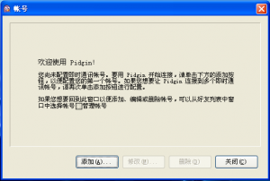
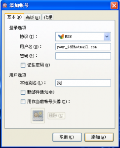
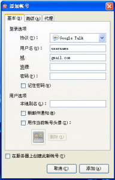
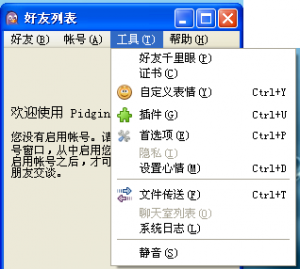
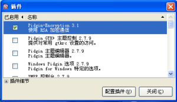
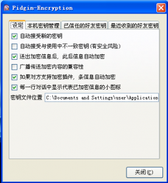
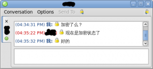

本教程针对使用Windows操作系统、计算机用得不熟练的人编写，在学习完本教程之后，你将可以学到如何安全的与恋人/亲人通信，避免第三人窥视。

[跳过介绍，直接看安装步骤](#pidgin-installation)

## 什么是Pidgin？

Pidgin是一款跨平台、支持多种即时通讯（IM）协议的聊天工具。属于开源软件，遵守GPLv2，目前Windows平台和Linux平台都可以运行，支持MSN、GTalk、Yahoo、Skype、Facebook、Twitter等帐号。国内常用的IM工具有QQ、MSN、GTalk、飞信、人人、百度Hi等。Pidgin目前很好的支持MSN和GTalk。虽然也支持QQ2008协议，但是腾讯会在QQ号登录几分钟后将QQ帐号锁定。飞信协议Pidgin的支持不是很好。

## 什么是Pidgin-Encryption？

Pidgin-Encryption是Pidgin的一款插件，可以端到端支持通信加密。当双方启用了Pidgin-Encryption之后，除了你的电脑和对方的电脑，中间的任何网络节点都无法看到你们在聊什么。Pidgin-Encryption的设计初衷是提供一款足够简单的加密方案，在插件安装之后只需要开启即可，不需要任何设置就可以使用，非常适合对计算机不是很熟悉的人使用。

## 为什么要用Pidgin和Pidgin-Encryption？

你可能从来没有想过，你在QQ/MSN上说出的每一句话都被记录。当你使用QQ/飞信（短信）/Gtalk/MSN/Skype的时候，你的聊天记录会被腾讯/移动/Google/微软/TOM（可能是永久的）保存，并可随时被该公司及其它机构查阅、分析。

如果你不想让自己和恋人/爱人的私密聊天内容被完全不认识的人作为娱乐的材料；如果你觉得自己在和恋人/爱人说悄悄话的时候，身边有一个不认识的人拿着录音笔记录会让你很尴尬；如果你想要保留一点点隐私，那么Pidgin和Pidgin-Encryption就是为你准备的。

在MSN/GTalk中文版上聊天相当于把话写在明信片上邮寄出去，所有经手的邮差（电脑）都能够看到，并复印一份；在QQ和GTalk英文版上聊天相当于把话写在信里，把信放到信封里邮寄给腾讯/Google，然后腾讯/Google把信封拆开，复印一份，再将信邮寄给跟你聊天的人。Pidgin-Encryption作用是一个翻译员，负责把你说的话翻译成只有对方的翻译员（Pidgin-Encryption）看得懂的语言，然后将翻译后的文字写到明信片（如果用MSN）或者信封里（如果用GTalk英文版）。这样，除了你和跟你聊天的那个人，其他人都不知道你们聊的内容。

## Pidgin-Encryption安全么？

Pidgin-Encryption使用了成熟的RSA加密机制，在原理上是安全的。具体的算法实现可以参考[Pidgin-Encryption主页](http://pidgin-encrypt.sourceforge.net/)。

没有任何加密算法能够保证你的信息万无一失。Pidgin-Encryption可以保证你的通信是安全的，但是是在你的电脑和对方的电脑安全的前提下。在下列条件下通信内容是不安全的：

- 你的电脑或者对方的电脑中了木马。 这样黑客就可以获取你的聊天记录、私钥等隐私内容。
- 你或对方的私钥被窃取。 私钥被窃取后，使用此私钥的所有通信都可能被解密。
- 你选择了存储聊天记录，而你的电脑被其他人接触。 聊天记录是明文存储的，这意味着一个人只要能登录你的Windows帐号，就可能看到你的聊天记录。
- 聊天的时候背后有人看着你。

## Pidgin和Pidgin-Encryption安装。

1. 点击进入[Pidgin官方网站](http://pidgin.im/download/windows/)，下载Pidgin的Windows的安装程序。因为是exe文件，浏览器可能认为有危险，会要求你确认是否下载。点击“是”确认下载。
2. 点击进入[Pidgin-Encryption网页](http://pidgin-encrypt.sourceforge.net/)，下载Pidgin-Encryption的安装文件，链接名称为“[Win32 self-extracting binary](http://sourceforge.net/projects/pidgin-encrypt/files/Windows%20Self-Installer/pidgin-encryption-3.1.exe/download)”。或者直接点击[这里](http://sourceforge.net/projects/pidgin-encrypt/files/Windows%20Self-Installer/pidgin-encryption-3.1.exe/download)直接下载3.1版。
3. 安装Pidgin Pidgin的安装过程和一般Windows软件相同，一路Next即可。如果修改了默认的安装目录，需要记住安装到哪里了。
4. 安装Pidgin-Encryption Pidgin-Encryption的安装过程和一般Windows软件相同，一路Next即可。**需要注意的是安装目录必须选择跟Pidgin一样的目录。**
5. 设置MSN/GTalk帐号
    1. 第一次启动时的设置 如果是安装完的第一次启动，Pidgin会弹出一个向导要求输入帐号信息，如下图所示：
        
        \[caption id="attachment\_89" align="alignnone" width="300" caption="Pidgin帐号设置向导"\]\[/caption\]
        
        点击“添加”按钮，进入“添加帐号”对话框。
    2. 设置MSN帐号
        
        \[caption id="attachment\_90" align="alignnone" width="243" caption="添加MSN帐号"\]\[/caption\]
        
        “协议”下拉菜单选择“MSN”协议，在用户名中输入你的MSN帐号。这个时候不需要输入密码，可以在登录的时候输入。**注意不要选中“记住密码”，因为Pidgin是明文存储你的登录密码的。** 本地别名是你和别人在聊天的时候显示的你的名字。如果空白，则默认是你MSN帐号的昵称。
    3. 设置GTalk帐号
        
        \[caption id="attachment\_91" align="alignnone" width="192" caption="添加GTalk帐号"\]\[/caption\]
        
        “协议”下拉菜单选择“Google Talk”协议，在用户名中输入你的GMail帐号。这个时候不需要输入密码，可以在登录的时候输入。**注意不要选中“记住密码”，因为Pidgin是明文存储你的登录密码的。**
6. 设置Pidgin-Encryption插件。
    1. 在Pidgin主面版上点击“工具”菜单，选择“插件”。
        
        \[caption id="attachment\_92" align="alignnone" width="300" caption="Pidgin 工具->插件"\]\[/caption\]
        
        在弹出的窗口中选中“Pidgin-Encryption”，如下图所示：
        
        \[caption id="attachment\_94" align="alignnone" width="300" caption="启用pidgin-encryption"\]\[/caption\]
        
        选中之后，点击“配置插件”按钮，对照下图选中部分选项：
        
        \[caption id="attachment\_95" align="alignnone" width="276" caption="设置pidgin-encryption"\]\[/caption\]
        
        点击“关闭”结束设置。
7. 设置结束，开始加密通信。
    1. 经过以上设置之后，我们就已经可以和朋友加密通信了。双击好友列表中的任意一位在线好友，打开聊天窗口之后，会看到菜单栏中间有一个锁的标志。默认锁是开着的，表示没有开启加密。点击这个小锁，就开启加密了。
        
        \[caption id="attachment\_96" align="alignnone" width="300" caption="带有加密插件的Pidgin聊天窗口"\]\[/caption\]
    2. 每次打开聊天窗口点击一下小锁按钮有点麻烦，Pidgin-Encryption提供了默认开启加密的功能。在Pidgin好友列表窗口中右击好友的头像，选中“开启自动加密（Turn Auto-Encrypt On）”，就可以了。

## 写在最后

1. Pidgin和Pidgin-Encryption相对于QQ等聊天工具，局限性还是很大的。除了聊天也就基本不能做别的事情了（不能视频，不能语音，传送文件很慢）。
2. Pidgin-Encryption不是默认功能，需要双方都安装才能使用，增加了第一次使用的难度。
3. Pidgin-Encryption是有局限性的，它假设用户的电脑是安全的。如果某人可以访问你的电脑（这种事情经常发生），拷贝出来你的私钥，你就没有任何安全性可言了。应对方法一个是用[EFS加密你的pidgin目录](http://winsystem.ctocio.com.cn/423/11440923.shtml)，防止有人绕过你的操作系统直接访问硬盘；第二个是定期更换私钥，当然这个不是很靠谱。
4. 除了Pidgin-Encryption之外还有pidgin-OTR、pidgin-GPG和Pidgin-Paranoia插件可以使用。功能类似，设置也都不复杂。感兴趣的同学可以看[这里](http://developer.pidgin.im/wiki/ThirdPartyPlugins#SecurityandPrivacy)。之所以使用Pidgin-Encryption，主要是因为刚开始上手的就是这个，原理上也是安全的，开源软件，至少不用担心有后门存在。
5. 建议不要相信任何非开源的加密软件，例如很多伴随QQ运行的“加密”软件，其“安全性”往往都是浮云。
6. 借用目前在百度实习的一位师兄的话结尾：“（有的时候）不是互联网公司侵犯了你的隐私，而是你把隐私放到了网上。” 如果不想有隐私被侵犯的感觉，那么就赶紧使用加密聊天工具吧。
