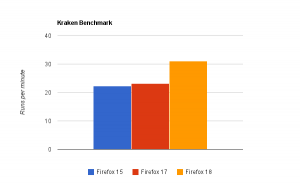
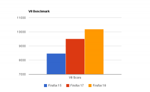

注：本文是对David Anderson[这篇博客文章](https://blog.mozilla.org/javascript/2012/09/12/ionmonkey-in-firefox-18/)的翻译。David介绍了IonMonkey的性能提升的内部架构，同时表示将在未来几周写更多的文章介绍IonMonkey。本博客将持续关注并翻译。

今天我们在Firefox 18中启用了我们最新的JavaScript JIT编译器，IonMonkey。IonMonkey不仅对JavaScript的执行性能有很大的提高，也是我们的编译器架构有了很大的进步。IonMonkey花费了超过一年的时间开发，我们都超级兴奋。

SpiderMonkey跟JIT的关系源远流长，但是你会发现SpiderMonkey的JIT编译器中缺少一个现代编译器，例如Java或C++编译器中都有的步骤。无论是老的TraceMonkey（作者注1）还是新的JaegerMonkey，都基本上是直接把JavaScript（从字节码）翻译到机器码。没有中间步骤，所以编译器也就没有办法看到翻译的结果，也就无法进一步的优化它们。

IonMonkey提供了一个全新的框架，使得我们可以做到这一点。它可以分成以下三步：

1. 将JavaScript翻译成中间表示（IR）；
2. 运行多种算法优化IR；
3. 将IR翻译成机器码。

让我们开心的不仅仅是性能和可维护性的提升，而且使得未来的JS编译器研究更加的简便。现在，有了IonMonkey，你就能够写一个新的优化，插入到流水线中，看看效果如何了。（译注：估计是受到了LLVM的启发？）

## 性能测试

IonMonkey针对的是长时间运行的程序，对于短程序还是用JaegerMonkey。我（David Anderson）在我跑着Windows 7专业版的MAC Pro笔记本上（译注1）运行了Google的V8基准测试和Kraken基准测试，性能提升了26%。Firefox 17运行了2602ms，Firefox 18运行了1921ms。效果如下图所示，越高越好。

\[caption id="attachment\_323" align="aligncenter" width="300"\] Kraken基准测试结果\[/caption\]

Google V8测试上Firefox 15得分为8474，Firefox 17得分为9511.Firefox 18得分最高，为10188，比Firefox 17快7%，比Firefox 15快50%。

\[caption id="attachment\_324" align="aligncenter" width="300"\] V8基准测试结果\[/caption\]

我们还有很多的工作需要去做。未来的一段时间我们将继续对IonMonkey进行测试，包括基准测试和真实的程序。

## 团队

对于我们而言IonMonkey最酷的部分就是我们是一个高度协作的团队。2011年6月的时候我们创建了一个大概的计划，然后估计大概需要一年的时间完成。我们招了四个实习生——Andrew Drake, Ryan Pearl, Andy ScheFirefox , 和 Hannes Verschore ——他们都参与实现了IonMonkey的核心组件，现在代码库中还有他们的代码。

2011年8月下旬我们开始组建全职团队，包括Jan de Mooij, Nicolas Pierron, Marty Rosenberg, Sean Stangl, Kannan Vijayan，还有我自己。（还有原SpiderMonkey开发者Chris Leary，2012年暑期实习生Eric Faust）。过去一年中我们齐头并进，搭出了总体的架构，确保其设计和代码质量都达到了最好，并且确实提升了JS的性能。

感谢我们所有的团队成员，大家为了一个目标一起合作的感觉太棒了。

## 技术

未来的几周我们将会发一些帖子介绍IonMonkey的主要组成以及工作原理。简而言之我将着重介绍IonMonkey中现有的优化技术：

- Loop-Invariant Code Motion (LICM)（循环不变量外提）；
- Sparse Global Value Numbering (GVN), （稀疏全局值编号？）；
- Linear Scan Register Allocation (LSRA), 线性扫描式寄存器分配算法；
- Dead Code Elimination (DCE), 死代码删除；
- Range Analysis; 边界分析（译注2）；

另外，我想指出IonMonkey能够运行在所有的Tier-1平台（译注3）上。编译器架构在设计上考虑了平台移植性的问题，大多数平台无关的代码都被抽取了出来，基本上只有汇编器是需要平台相关的。我们对此深感自豪。

## 何时，何地？

IonMonkey将在Firefox 18默认开始，Firefox 18现在是Firefox Nightly状态，将在10月8号变成Aurora，在11月10号进入beta版本。

作者注1：TM其实是有一个中间层额，但是能力非常的有限（limited），无法处理after-the-fact类型的优化。

译者注1：这个配置，想起来“普通青年Thinkpad+Windows，文艺青年Mac Pro + Mac OS……”

译者注2：参见[Ryan Pearl和Michael Sullivan的这篇论文（PDF）](http://www.endofunctor.org/~cmplrz/paper.pdf)。

译者注3：[Tier-1平台](https://developer.mozilla.org/en-US/docs/Supported_build_configurations)包括以下配置

- Android Linux/ARMv7 and ARMv6 (gcc)
- Linux/x86 and x86-64 (gcc)
- OS X/x86 and x86-64 (clang)
- Windows/x86 (msvc)
