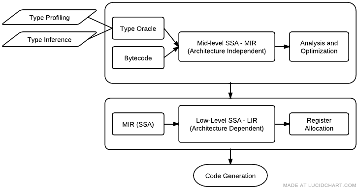

本文的内容整理自 [https://wiki.mozilla.org/IonMonkey/Overview](https://wiki.mozilla.org/IonMonkey/Overview)

IonMonkey的代码位于“Mozilla-central/js/src/ion”目录下，目前有149个文件，4个子目录，代码43679行。从编译器的角度来说这个代码的规模还不算大，结构相对简单。根据Mozilla Wiki的[这张结构图](https://wiki.mozilla.org/File:Ionmonkey_overview.png)可以看到IonMonkey使用了MIR和LIR两层IR结构：

\[caption id="attachment\_341" align="aligncenter" width="522"\] IonMonkey结构\[/caption\]

IonMonkey的代码可以按照这张结构图分成以下几个部分：

- **前端，将JavaScript字节码翻译到MIR：**
    - IonBuilder.\* 将字节码翻译到MIR，比较大，6801行代码；
    - MIR.\* 组成MIR的类，共6979行代码；
    - MIRGenerator.h ：不到一百行代码，不知道是什么东西；
    - MIRGraph.\* ：1407行代码，基本块和控制流图构建与维护；
    - MOpcodes.h：MIR操作码，定义了117个opcode。SpiderMonkey的其它模块都将操作码等数据放在\*.tbl文件中，或许该文件也会在后续被分拆出来。
- **在MIR上进行的分析和优化；**
    - IonAnalysis.{cpp,h} ：一些小的分析算法，例如计算DominatorTree，计算Phi节点等。1052行代码；
    - LICM.{h,cpp}：循环不变量外提代码，总共661行代码；
    - TypeOracle.h：Type Oracle的接口文件，379行代码；
    - TypePolicy.{h,cpp}：定义类型具体化的规则，共739行代码；
    - ValueNumbering.{h,cpp} ：全局值编号算法；
- **将MIR转译到LIR的Lowering过程；**
    - Lowering.\* 生成LIR结构。
    - LIR-Common.h：硬件平台通用的LIR指令，三千多行；
    - LOpcodes.\* ：平台通用的LIR opcode。
        - shared/Lowering-x86-shared.\* ：x86和x64共用的LIR代码；
        - <arch>/Lowering-<arch>.\* ：平台特定的LIR代码；
        - <arch>/LIR-<arch>.h ： 平台特定的LIR指令；
        - <arch>/LOpcodes-<arch>.h ：平台特定的LIR opcode；
- **寄存器分配、指令调度、代码生成；**
    - GreedyAllocator.\* - 贪心寄存器分配算法.目前还没有出现在主分支中；
    - LinearScan.\* - 线性扫描分配器算法；
    - CodeGenerator.\* ：代码生成功能入口，包含了很多共用代码；
        - shared/CodeGenerator-shared.\* ：可以被所有平台使用的代码生成逻辑；
        - shared/CodeGenerator-x86-shared.\* ：x64和x86平台共用的代码；
        - <arch>/CodeGenerator-<arch>.\* ：特定平台的代码；
    - MoveResolver.\* ：目前不清楚是干什么的，Mozilla Wiki的原文是“Performs cycle detection and topological sorting of parallel moves.”；
    - shared/MoveEmitter-x86-shared.\*： 目前不清楚是干什么的，Mozilla Wiki的原文是“Emits a sequence of parallel moves that have been cycle-detected and topologically sorted.”
    - <arch>/StackAssignment-<arch>.h：RA算法用到的辅助类，用于在栈上分配空间。
    - <arch>/Architecture-<arch>.h：硬件平台信息，例如寄存器数量和名字，调用规范等。
    - IonRegisters.h：寄存器交互相关的C++辅助类。
    - IonMacroAssembler.h：平台无关的汇编辅助类。
    - shared/MacroAssembler-x86-shared.h：x86和x64共享的抽象汇编器类。
    - <arch>/MacroAssembler-<arch>.h：x86的汇编类。
    - Assembler-shared.h：用于进行代码汇编的数据结构。
    - shared/Assembler-x86-shared.h：x86和x64共享的指令集辅助类。
    - <arch>/Assembler-<arch>.\*：平台相关的指令集辅助类。
    - IonLinker.h\*：将生成好的代码移动到可执行内存页中。
- **运行时支持：**
    
    - Bailouts.\* ：当遇到类型推测失败等情况时使用。David在邮件列表中说“A guard failure, type-inference invalidation, or GC can cause a "bailout". A bailout is when an Ion frame on the stack must be converted back into an interpreter frame. When this happens, interpreter frames are created for each JS frame in the Ion frame (there can be multiple because of inlining), and we resume running the function in the interpreter instead.”
        - <arch>/Bailouts-<arch>.\* - 平台相关的bailout辅助类。
    
    - <arch>/Trampolines-<arch>.cpp - 平台相关的trampolines类.
- **数据结构及其它辅助代码：**
    - IonCode.h ：IonCode、IonScript的声明；
    - IonCompartment.h ：IonCompartment的声明；
    - IonFrames.h ：Ion frames布局声明；
    - BitSet.\* ：一个任意大小的比特集合实现。
    - C1Spewer.\*：调试用的一个工具；
    - FixedArityList.h ：模板，生成固定大小的向量类；
    - InlineList.h ：来对象之间内建链表结构；
    - IonAllocPolicy.h ：基于内存池的分配实现；
    - IonSpewer.\* ：调试用工具；
    - JSONSpewer.\* ：JSON调试用工具。
