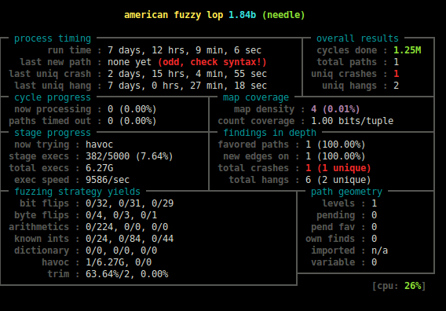

afl-fuzz\[1\] 是一个很不错的 fuzzer. 而 John Regehr 大牛觉得有些方面还是不行, 于是写了一篇博客\[2\], 给出来一个 C 程序, 吐槽了一把.

C 程序是这样子的:

#include <stdlib.h>
#include <stdio.h>

int main(void) {
    char input\[32\];
    if (fgets(input, 32, stdin)) {
        long n = strtol(input, 0, 10);
        printf("%ld\\n", 3 / (n + 1000000));
    }
    return 0;
}

这里的触发 crash 的输入需要触发 **n + 1000000 == 0**, 进而触发一个 **3 / 0** 的除法错误.

No Data, No Talk. 我跑了下这个 testcase. 你猜怎么着? 竟然给 afl-fuzz 随机试出来了 :-)

 

afl-fuzz 给出来的 input 是这样子的:

> \-1000000#23#

后面的 #23# 不知道怎么出来的, 不相关, 前面的 -1000000 是正确答案.

尝试了 125 万次, 跑了7天. 嗯. John Regehr 说的也是对的, 在这个 Case 中, 路径覆盖没有帮上忙, 基本上都是纯随机在暴力搜索.

 

\[1\] [http://lcamtuf.coredump.cx/afl/](http://lcamtuf.coredump.cx/afl/)

\[2\] [http://blog.regehr.org/archives/1238](http://blog.regehr.org/archives/1238)
