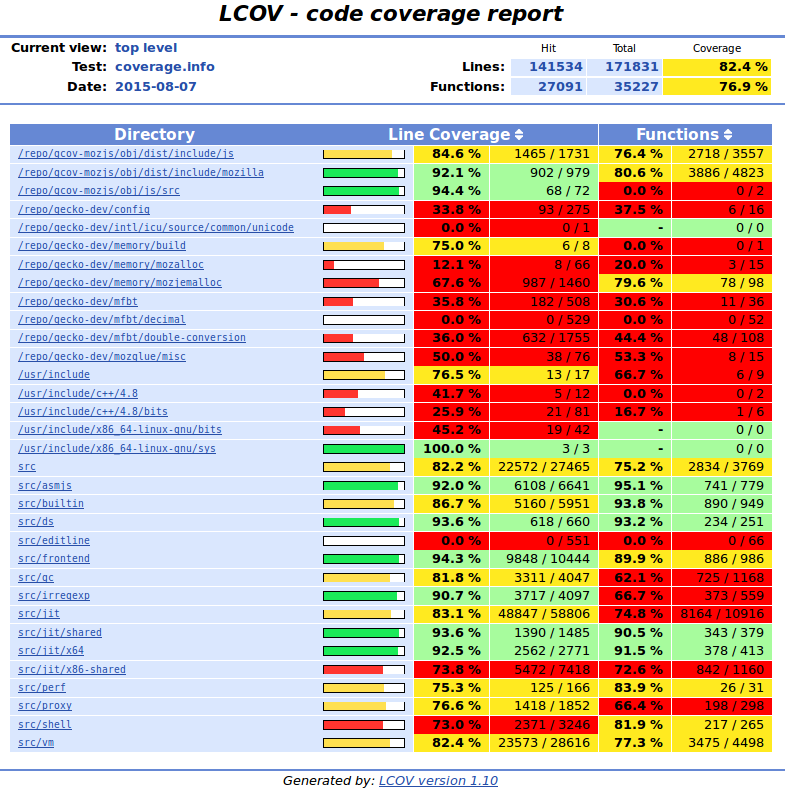

最简单的方法还是用 GCC/GCOV/LCOV 系列. 以下是方法:

\# 编译 SpiderMonkey
CFLAGS="-fprofile-arcs --coverage" CXXFLAGS="-fprofile-arcs --coverage" ~/gecko-dev/js/src/configure --enable-debug && make -j 8

# 跑回归测试集
cd ~/gecko-dev/js/src/tests/
./jstests.py ~/gcov-mozjs/obj/dist/bin/js
cd ../jit-test/
./jit\_test.py ~/gcov-mozjs/obj/dist/bin/js

# 生成HTML
lcov --capture --directory mozjs-obj/ --output-file mozjs-coverage.info
genhtml mozjs-coverage.info --output-directory lcov-output/

获取之后就可以直接用浏览器打开看了.

需要注意的是这个只能看到函数覆盖率和代码行覆盖. 更细致的覆盖度, 例如路径覆盖, 可能需要别的工具了(not sure).

从代码覆盖度上看, 还是有一些代码是没有测试到的. 看了一下原因可以分成几类:

1. 我编译 SpiderMonkey 的时候使用了'--enable-debug'编译, 有一些调试代码没有执行到;
2. 测试使用的是Mozilla自带的回归测试脚本, 用于交互式执行的部分, 例如 editline, 都没有执行到;
3. 硬件配置相关的部分, 由于我使用的机器是 X86\_64 SSE4.2, 所以有一些特定的代码也是覆盖不到的;
4. 最后, 就是测试集可以覆盖但是没有覆盖到的代码部分.

完整的覆盖信息可以看 [http://hellocompiler.com/spidermonkey/lcov/index.html](http://hellocompiler.com/spidermonkey/lcov/index.html)
